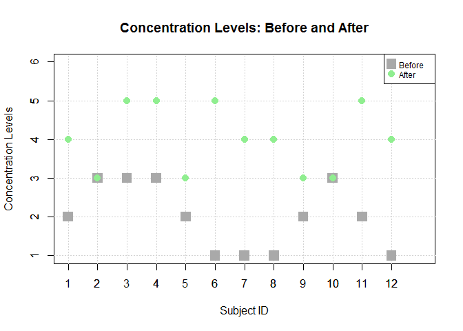
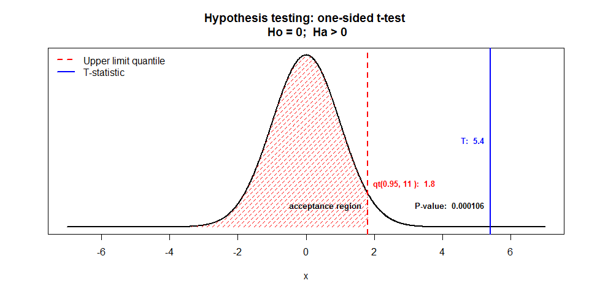
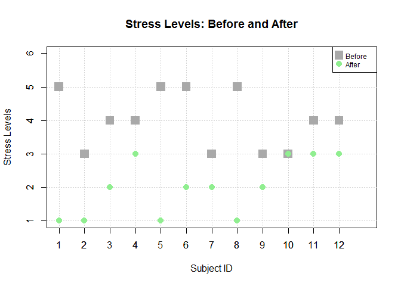
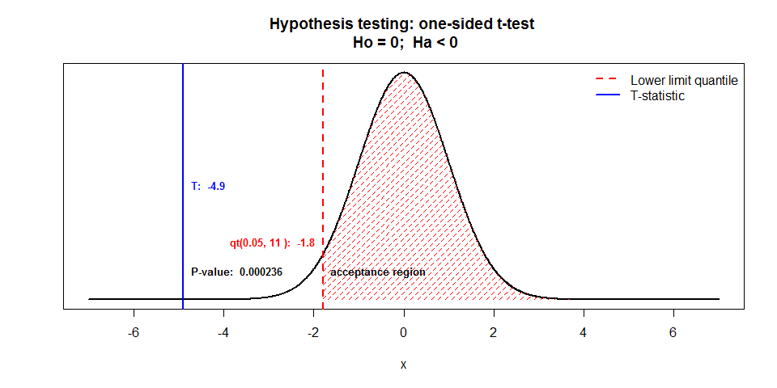
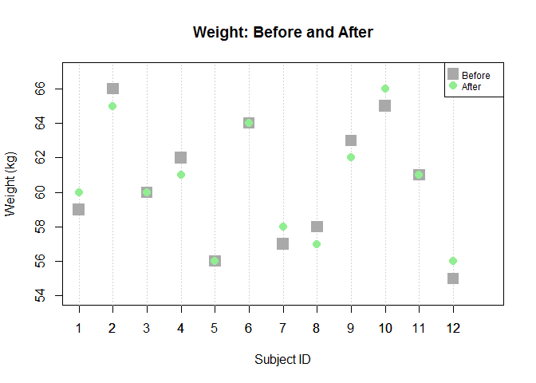
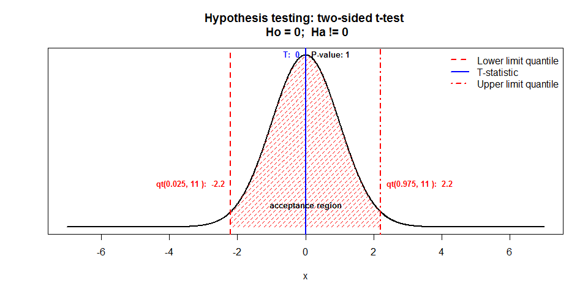

The purpose of this document is to provide visual examples to ease the understanding of concepts related to hypothesis testing using t-tests and p-value for paired data. We will create some simple, entirely fictitious scenario and data for our examples. 

## Scenario

Imagine: Meditation Promoters Institute wants to statistically establish the benefits of meditation on people. The three hypotheses the Institute wants to test are, that meditation:   

1. INCREASES concentration levels  
2. DECREASES stress levels  
3. DOES NOT CHANGE body weight  

For their experiment, they recruit 12 volunteers and record their:  

1. Concentration levels on a 5-point scale: 1 - very low to 5 - very high  
2. Stress levels on a 5-point scale: 1 - very low to 5 - very high  
3. Body weight in kgs.  

This data is stored as "before". After a 6-month regime of daily 30-minute meditation, the same parameters are checked again, and the new data stored as "after".  

## Dataset 


We have created and stored experiment data in a data.frame called "meditate." It stores before and after data for each of the 12 subjects. Let us look at the size of the entire dataset and at records for three of the twelve volunteers. 


```
## [1] 24  5
```

```
##    subject.id timing concentration stress weight
## 1           1 before             2      5     59
## 2           2 before             3      3     66
## 3           3 before             3      4     60
## 13          1  after             4      1     60
## 14          2  after             3      1     65
## 15          3  after             5      2     60
```


In all, 24 rows and 5 fields: 2 rows of "before" and "after" observations for 3 parameters: concentration, stress, and weight for each of the 12 subjects. 

**Since the "before" and "after" sets are for the same subjects--not two independent groups--our data is PAIRED.**


## Hypothesis testing: Increased concentration

Let us look at the "concentration" data we have on the volunteers. 

<!-- -->


There does appear to be an increase in concentration levels for most volunteers. But let us test this with a t-test.  

### T-Test

Null hypothesis **Ho: mean difference between after and before = 0**  
Alternative hypothesis **Ha: mean difference between after and before > 0**  

Let "before" be the set of all concentration observations prior to meditation.
And "after" be the set of all concentration observations post meditation.


```r
before = meditate$concentration[meditate$timing=="before"]
after = meditate$concentration[meditate$timing=="after"]

t.test(after, before, paired = TRUE, alternative = "greater")
```

```
## 
## 	Paired t-test
## 
## data:  after and before
## t = 5.416, df = 11, p-value = 0.0001057
## alternative hypothesis: true difference in means is greater than 0
## 95 percent confidence interval:
##  1.336826      Inf
## sample estimates:
## mean of the differences 
##                       2
```

**Note that default confidence level of t-test is 95%, i.e. the desired rate of Type 1 Error is 5% or 0.05.**  
  
    
How to interpret the results of this t-test? Let us see graphically: 

<!-- -->

We see that the **t-statistic lies well outside the acceptance region**, hence we must **reject Ho** or **accept Ha** that *mean of difference between "after" and "before" levels of concentration is greater than zero*.  


### P-Value 

From the t-test results, we see that the p-value is much smaller than the desired rate of Type 1 Error of 0.05 or 5%. This too supports rejection of Ho, as well as states that the alternative hypothesis, Ha--*mean difference between after and before levels of concentration is greater than zero*-- is statistically significant. 


Meditation Promoters Institute could now claim that after 30-minutes of daily meditation for 6 months, its 12 test volunteers on an average did actually experience increase in concentration levels.


## Hypothesis testing: Decreased stress

Let us look at the "stress" data we have on the volunteers. 

<!-- -->


There does appear to be a decrease in stress levels for most volunteers. But let us test this with a t-test.  

### T-Test

Null hypothesis **Ho: mean difference between after and before = 0**  
Alternative hypothesis **Ha: mean difference between after and before < 0**  

Let "before" be the set of all stress observations prior to meditation.
And "after" be the set of all stress observations post meditation.


```r
before = meditate$stress[meditate$timing=="before"]
after = meditate$stress[meditate$timing=="after"]

t.test(after, before, paired = TRUE, alternative = "less")
```

```
## 
## 	Paired t-test
## 
## data:  after and before
## t = -4.899, df = 11, p-value = 0.0002362
## alternative hypothesis: true difference in means is less than 0
## 95 percent confidence interval:
##       -Inf -1.266833
## sample estimates:
## mean of the differences 
##                      -2
```


How to interpret the results of this t-test? Let us see graphically: 

<!-- -->

We see that the **t-statistic lies well outside the acceptance region**, hence we must **reject Ho** or **accept Ha** that *mean of difference between "after" and "before" levels of stress is less than zero*.  


### P-Value

From the t-test results, we see that the p-value is much smaller than the desired rate of Type 1 Error of 0.05 or 5%. This supports rejection of Ho and also states that the alternative hypothesis, Ha--*mean difference between after and before levels of stress is less than zero*--is statistically significant. 


Meditation Promoters Institute could now claim that after 30-minutes of daily meditation for 6 months, its 12 test volunteers on an average did actually experience decrease in stress levels.


## Hypothesis testing: No significant change in weight

Let us look at the "weight" data we have on the volunteers. 

<!-- -->


There appears to be some change in weight levels for some volunteers - a few have gained, others have lost. Yet others show no change. But, we are not sure if there is a significant change on the whole. So, let us test this with a t-test.  


### T-Test

Null hypothesis **Ho: mean difference between after and before = 0**  
Alternative hypothesis **Ha: mean difference between after and before != 0**  

Let "before" be the set of all weight observations prior to meditation.
And "after" be the set of all weight observations post meditation.


```r
before = meditate$weight[meditate$timing=="before"]
after = meditate$weight[meditate$timing=="after"]

t.test(after, before, paired = TRUE, alternative = "two.sided")
```

```
## 
## 	Paired t-test
## 
## data:  after and before
## t = 0, df = 11, p-value = 1
## alternative hypothesis: true difference in means is not equal to 0
## 95 percent confidence interval:
##  -0.5418451  0.5418451
## sample estimates:
## mean of the differences 
##                       0
```

How to interpret the results of this t-test? Let us see graphically: 

<!-- -->

We see that the **t-statistic lies well within the acceptance region**, hence we must **reject Ha** or **accept Ho** that *mean of difference between "after" and "before" levels of weight is zero*.  


### P-Value

From the t-test results, we see that the p-value is much larger than the desired rate of Type 1 error of 0.05 or 5%. This supports acceptance of Ho or we fail to reject Ho. It also states that the alternative hypothesis, Ha--*mean difference between after and before levels of weight is not equal to zero*--is not statistically significant. 


Meditation Promoters Institute could now claim that after 30-minutes of daily meditation for 6 months, its 12 test volunteers on an average did not experience significant change in weight levels.


## Conclusion


Ho | Ha | Test to use | Aceptance region 
--------------------|----------------------|--------------------------------|---------------------
mean difference = 0 | mean difference != 0 | t.test(x, y, paired = TRUE, alternative = "two.sided") | Lower bound = qt(0.025, df); Upper bound = qt(0.975, df) 
mean difference = 0 | mean difference < 0 | t.test(x, y, paired = TRUE, alternative = "less") | Lower bound = qt(0.05, df); Upper bound = +ve infinity
mean difference = 0 | mean difference > 0 | t.test(x, y, paired = TRUE, alternative = "greater") | Lower bound = -ve infinity; Upper bound = qt(0.95, df)
  
  
And in all three cases above, if T-STATISTIC is  

Within acceptance region | Outside acceptance region
-----------------|-----------------
Accept Ho, reject Ha | Reject Ho, accept Ha  
  
  
And if P-VALUE is  

Smaller than Type 1 Error rate | Larger than Type 1 Error rate
-----------------|-----------------
Ha is statistically significant | Ha is not statistically significant
